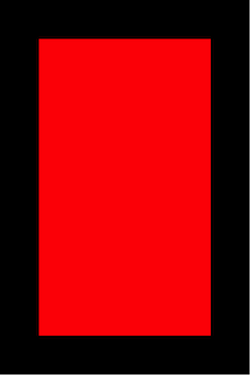

---

title: AutoLayout之Masonry的使用

date: 2016-06-15 23:26:37

tags: [AutoLayout,Masonry]

---

## AutoLayout简介

### 含义
* AutoLayout是一种基于约束的，描述性的布局系统。
( Auto Layout is a Constraint-Based, Descriptive Layout System.)
* 使用约束条件来描述布局。view的frame会依据这些约束来自动进行计算。
(Describe the layout with constraints, and frames are calculated automatically.)

### 与设置frame方式相比的优点
* 多数情况下旋转屏幕不用再做额外的处理
* 更容易适配不同尺寸的屏幕
* 上手后布局非常简单容易，布局逻辑更清晰

<!--more-->

### 用法
在iOS6之前，关于屏幕旋转的适配和iPhone，iPad屏幕的自动适配，基本都是由AutoresizingMask来完成的。但是随着大家对iOS App的要求越来越高，以及今后可能出现的多种屏幕和分辨率的设备来说，AutoresizingMask显得有些落伍和迟钝了。

iOS6以后，AutoLayout出现，其可以完成所有原来AutoresizingMask能完成的工作，同时还能够胜任一些原来无法完成的任务。

使用AutoLayout时，需要禁用AutoresizingMask：
`view.translatesAutoresizingMaskIntoConstraints = NO;`

AutoLayout中约束对应的类为 NSLayoutConstraint，一个 NSLayoutConstraint 实例代表一条约束。

NSLayoutConstraint有2个类方法用于创建约束实例:

#### 1、直白式方法
	+ (instancetype)constraintWithItem:(id)view1
                         attribute:(NSLayoutAttribute)attr1
                         relatedBy:(NSLayoutRelation)relation
                            toItem:(id)view2
                         attribute:(NSLayoutAttribute)attr2
                        multiplier:(CGFloat)multiplier
                          constant:(CGFloat)c;
代表的含义为：`view1.attr1 = view2.attr2 * multiplier + constant`，够直白吧！

#### 2、VFL式方法
	+ (NSArray *)constraintsWithVisualFormat:(NSString *)format
                                 options:(NSLayoutFormatOptions)opts
                                 metrics:(NSDictionary *)metrics
                                   views:(NSDictionary *)views;
该方法使用可视化格式语言(VFL)布局。

#### 实例
下面我们分别使用以上2种方法进行如下布局：
`子view在父view中，其中子view的上下左右边缘都离父view的边缘50 point`

##### 直白式方法代码
直白式方法布局，代码冗长，不易维护。
    
	self.view.backgroundColor = [UIColor blackColor];
	UIView *superView = self.view;
	
	UIView *subView = [[UIView alloc] init];
	subView.translatesAutoresizingMaskIntoConstraints = NO;
	subView.backgroundColor = [UIColor redColor];
	[self.view addSubview:subView];
	
	NSLayoutConstraint *topConstraint = [NSLayoutConstraint constraintWithItem:subView
	                                                                 attribute:NSLayoutAttributeTop
	                                                                 relatedBy:NSLayoutRelationEqual
	                                                                    toItem:superView
	                                                                 attribute:NSLayoutAttributeTop
	                                                                multiplier:1.0
	                                                                  constant:50];
	
	NSLayoutConstraint *bottomConstraint = [NSLayoutConstraint constraintWithItem:subView
	                                                                 attribute:NSLayoutAttributeBottom
	                                                                 relatedBy:NSLayoutRelationEqual
	                                                                    toItem:superView
	                                                                 attribute:NSLayoutAttributeBottom
	                                                                multiplier:1.0
	                                                                  constant:-50];
	
	NSLayoutConstraint *leftConstraint = [NSLayoutConstraint constraintWithItem:subView
	                                                                 attribute:NSLayoutAttributeLeft
	                                                                 relatedBy:NSLayoutRelationEqual
	                                                                    toItem:superView
	                                                                 attribute:NSLayoutAttributeLeft
	                                                                multiplier:1.0
	                                                                  constant:50];
	
	NSLayoutConstraint *rightConstraint = [NSLayoutConstraint constraintWithItem:subView
	                                                                 attribute:NSLayoutAttributeRight
	                                                                 relatedBy:NSLayoutRelationEqual
	                                                                    toItem:superView
	                                                                 attribute:NSLayoutAttributeRight
	                                                                multiplier:1.0
	                                                                  constant:-50];
	
	[superView addConstraints:@[topConstraint, bottomConstraint, leftConstraint, rightConstraint]];

##### VFL式方法代码
VFL式方法布局，采用ascll字符描述约束，各种坑，且不易理解。

	self.view.backgroundColor = [UIColor blackColor];
	UIView *superView = self.view;
	
	UIView *subView = [[UIView alloc] init];
	subView.translatesAutoresizingMaskIntoConstraints = NO;
	subView.backgroundColor = [UIColor redColor];
	[self.view addSubview:subView];
	
	NSDictionary *views = NSDictionaryOfVariableBindings(subView);
	NSArray *constraintsH = [NSLayoutConstraint constraintsWithVisualFormat:@"H:|-50-[subView]-50-|"
	                                                                options:0
	                                                                metrics:nil
	                                                                  views:views];
	NSArray *constraintsV = [NSLayoutConstraint constraintsWithVisualFormat:@"V:|-50-[subView]-50-|"
	                                                                options:0
	                                                                metrics:nil
	                                                                  views:views];
	[superView addConstraints:constraintsH];
	[superView addConstraints:constraintsV];

---

显然，无论使用哪种方法来编写布局代码都比较麻烦，好消息是有大量的开源库帮助我们提高编写布局代码的效率。

## 开源库Masonry

### 常用的开源库
* Masonry
* PureLayout(前UIView-AutoLayout)
* FLKAutoLayout
* KeepLayout

### Masonry简介
Masonry是一个轻量级的布局框架，拥有自己的描述语法，采用更优雅的链式语法封装自动布局，简洁明了并具有高可读性，而且同时支持 iOS 和 Max OS X。Masonry是一个用代码写iOS或OS界面的库，可以代替AutoLayout。Masonry的Swift版本名叫SnapKit，支持iOS7，OS X 10.9以上。

对于上文中的布局效果，使用Masonry布局的代码如下：（简洁、直观）

	self.view.backgroundColor = [UIColor blackColor];
	UIView *superView = self.view;
	
	UIView *subView = [[UIView alloc] init];
	subView.translatesAutoresizingMaskIntoConstraints = NO;
	subView.backgroundColor = [UIColor redColor];
	[self.view addSubview:subView];
	
	[subView mas_makeConstraints:^(MASConstraintMaker *make) {
	    make.edges.equalTo(superView).with.insets(UIEdgeInsetsMake(50, 50, 50, 50 ) );
	}];

### Masonry用法
Masonry共三个布局方法：

* mas_makeConstraints；添加约束
* mas_updateConstaints；更新约束，只更新约束的常量值时使用
* mas_remakeConstaints；更新约束，但是之前所有约束会被移除掉

#### 基本使用方法
	[subView mas_makeConstraints:^(MASConstraintMaker *make) {
		make.left.equalTo(superView.mas_left).with.offset(50);
		make.right.equalTo(superView.mas_right).with.offset(-50);
		make.top.equalTo(superView.mas_top).with.offset(50);
		make.height.equalTo(superView).with.offset(-100);
	}];

其中， maker的属性包括：left、top、right、bottom、leading、trailing、width、height、centerX、centerY、baseLine及复合属性edges、size、center。

与equalTo类似的方法还有：lessThanOrEqualTo、greaterThanOrEqualTo。

view的属性如下：

| MASViewAttribute | NSLayoutAttribute         |
| :--------------- | :------------------------ |
| view.mas_left    | NSLayoutAttributeLeft     |
| view.mas_right   | NSLayoutAttributeRight    |
| view.mas_top     | NSLayoutAttributeTop      |
| view.mas_bottom  | NSLayoutAttributeBottom   | 
| view.mas_leading | NSLayoutAttributeLeading  | 
| view.mas_trailing| NSLayoutAttributeTrailing | 
| view.mas_width   | NSLayoutAttributeWidth    |
| view.mas_height  | NSLayoutAttributeHeight   |
| view.mas_centerX | NSLayoutAttributeCenterX  |
| view.mas_centerY | NSLayoutAttributeCenterY  |
| view.mas_baseline| NSLayoutAttributeBaseline |      

#### 常用案例
	//these two constraints are exactly the same
	make.left.greaterThanOrEqualTo(label);
	make.left.greaterThanOrEqualTo(label.mas_left);

	//width >= 200 && width <= 400
	make.width.greaterThanOrEqualTo(@200);
	make.width.lessThanOrEqualTo(@400)

通常，当常量和结构体作为参数时，使用“mas_”前缀的关系方法：

	make.top.mas_equalTo(42);
	make.height.mas_equalTo(20);
	make.size.mas_equalTo(CGSizeMake(50, 100));
	make.edges.mas_equalTo(UIEdgeInsetsMake(10, 0, 10, 0));
	make.left.mas_equalTo(view).mas_offset(UIEdgeInsetsMake(10, 0, 10, 0));

maker复合属性的使用案例：

edges:

	// make top, left, bottom, right equal view2
	make.edges.equalTo(view2);
	
	// make top = superview.top + 5, left = superview.left + 10,
	// bottom = superview.bottom - 15, right = superview.right - 20
	make.edges.equalTo(superview).insets(UIEdgeInsetsMake(5, 10, 15, 20))

size:

	// make width and height greater than or equal to titleLabel
	make.size.greaterThanOrEqualTo(titleLabel)
	
	// make width = superview.width + 100, height = superview.height - 50
	make.size.equalTo(superview).sizeOffset(CGSizeMake(100, -50))
	
center:

	// make centerX and centerY = button1
	make.center.equalTo(button1)
	
	// make centerX = superview.centerX - 5, centerY = superview.centerY + 10
	make.center.equalTo(superview).centerOffset(CGPointMake(-5, 10))

### Masonry下载地址
OC版本：[https://github.com/SnapKit/Masonry](https://github.com/SnapKit/Masonry)

Swift版本：[https://github.com/SnapKit/SnapKit](https://github.com/SnapKit/SnapKit)


