### 说到前面的

最近接触了一点逆向的东西，在网上看到这篇文章[《一步一步实现iOS微信自动抢红包(非越狱)》](http://www.jianshu.com/p/189afbe3b429)，于是按着步骤实现了一把，但是过程躺过太多坑，所以自己重新整理下如何实现iOS微信自动抢红包功能的过程。这篇文章目的在于记录逆向微信的一个大致流程，不会深入讲解如何逆向找到抢红包相关的函数（直接使用大神的成果），另外也仅限技术研究和交流。

`注意：文中截图出现的IP地址可能有多个，是因为在不同地方写完这篇文章，但都是指iPhone的IP`

<!--more-->

### 准备工作

* 越狱手机一台（我的是iPhone 5s，9.1系统）
* iTools
* 新建文件夹`ReverseWeChat`（名字随意），后续相关文件都放里面，便于管理

### 获取微信可执行文件路径和Documents路径

1. 越狱iPhone上使用Cydia安装OpenSSH（默认已安装）、cycript（可在命令行下和应用交互,在运行时查看和修改应用）；
2. 进入Mac终端使用ssh命令进入手机（确保Mac与iPhone处于同一网段），默认密码为alpine，如下图：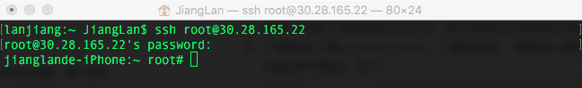
3. iPhone上只开启微信，其它App全部关闭，终端使用ps命令查看当前进程情况（终端一定要拉长，否则信息显示不全，显示出信息后，可将终端随意缩放，信息会自动换行，这可能是终端的bug），如下图（截图）：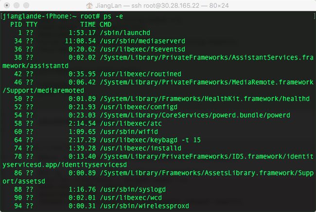搜索"/var/mobile/"，理论上只会有一条结果，即微信可执行文件路径，如下图：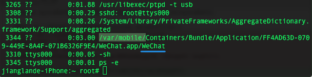记下该路径；
4. 使用cycript进入微信进程，并查看Documents路径，如下图：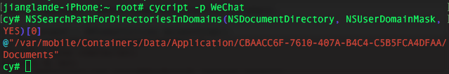
记下该路径。

##### 福利：通过USB使用ssh连接iPhone

以上是使用网络连接iPhone，但是偶尔网络不好时，各种命令执行非常慢，这种情况我们可以使用USB方式连接，速度杠杠的。

* 将iPhone通过USB连接Mac；
* 下载[usbmuxd 1.0.8版本](http://cgit.sukimashita.com/usbmuxd.git/snapshot/usbmuxd-1.0.8.tar.gz)，以上版本貌似不支持此方式连接；
* 在Mac上解压usbmuxd-1.0.8.tar.gz，cd到python-client文件夹下；
* 命令行输入：python tcprelay.py -t 22:2222
* 屏幕显示：Forwarding local port 2222 to remote port 22（成功）
* 另起命令行输入：ssh root@localhost -p 2222

成功通过USB使用ssh连接到iPhone，速度比Wi-Fi快多了，此时断开Wi-Fi也能使用（保持iPhone的USB连接）


### 解密微信可执行文件（脱壳）

由于从App Store下载的App都是经过苹果加密的，所以需要对下载的App进行解密，即脱壳。

5. 下载脱壳工具[dumpdecrypted](https://github.com/stefanesser/dumpdecrypted)，下载完成后，终端进入源码目录并使用make命令编译，如下图：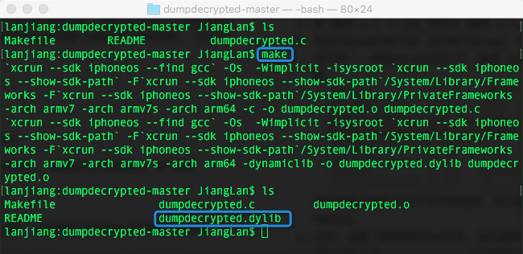编译之后会生成dumpdecrypted.dylib，将该文件通过scp命令拷贝到微信的Documents下，如下图：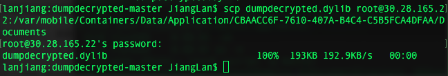
6. 通过ssh进入iPhone，并cd到Documents下，使用dumpdecrypted.dylib开始砸壳，如下图：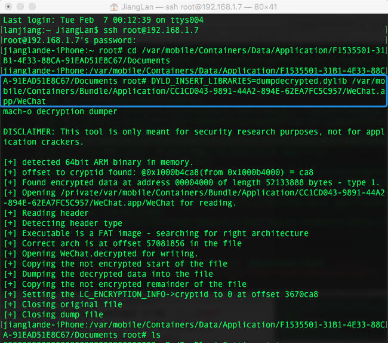
7. 砸壳后，会在当前目录（即Documents下）生成已经解密后的微信可执行文件WeChat.decrypted，如下图：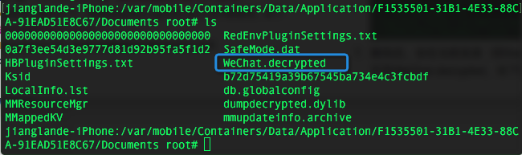
8. 另启终端窗口，并cd到ReverseWeChat目录，使用scp命令将Documents下的WeChat.decrypted拷贝到该目录，如下图：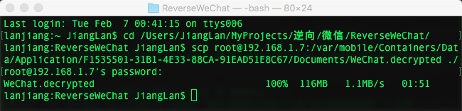

### dump微信头文件

1. 从Github下载[class-dump](https://github.com/nygard/class-dump)源码，编译后生成class-dump工具，并拷贝到ReverseWeChat目录；
2. 使用class-dump工具dump出头文件，如下图：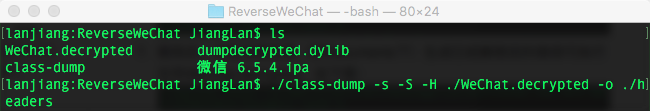执行完之后，微信所有头文件就被dump在ReverseWeChat目录下的headers文件夹下，如下图：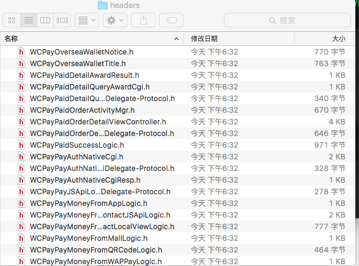

### 创建动态库dylib，编写hook代码

自动抢红包的原理是通过创建dylib，在dylib中hook微信的新消息函数，我们判断是否为红包消息，如果是，就调用微信的打开红包方法，这样就能达到自动抢红包的目的了。下面直接给出相关方法：

1. CMessageMgr.h中的 `-(void)AsyncOnAddMsg:(id)arg1 MsgWrap:(id)arg2`;
2. WCRedEnvelopesLogicMgr.h中的 `-(void)OpenRedEnvelopesRequest:(id)arg1`;

#### 安装iOSOpenDev

因为Xcode默认不支持生成dylib，所以需要下载安装[iOSOpenDev](http://iosopendev.com/download/)，如果安装失败请参考[这里](http://www.cnblogs.com/Keys/p/5364939.html)，安装完成后即可选择创建dylib工程，如下图：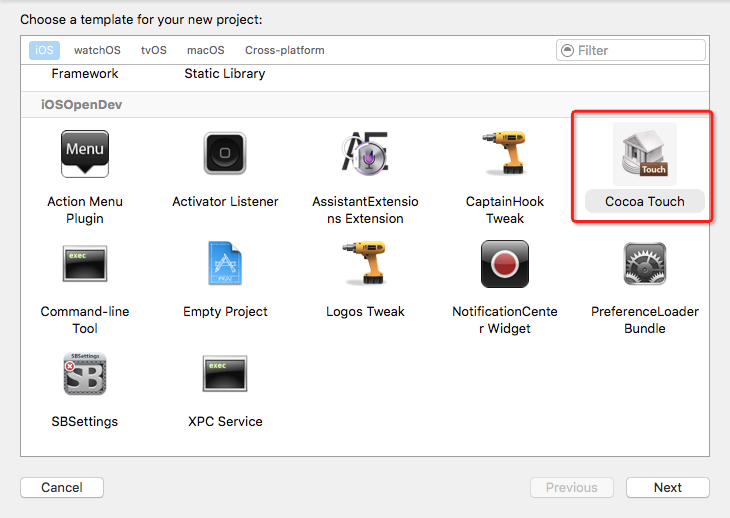

#### 新建dylib，编写hook代码

选择Cocoa Touch Library，新建了一个dylib工程，命名为autoGetRedEnv。删除autoGetRedEnv.h文件，修改autoGetRedEnv.m为autoGetRedEnv.mm，然后在项目中加入[CaptainHook.h](https://github.com/rpetrich/CaptainHook)。

因为微信不会主动来加载我们的hook代码，所以我们需要把hook逻辑写到构造函数中，如下：

```
__attribute__((constructor)) static void entry()
{
  	CHLoadLateClass(CMessageMgr);
    CHClassHook(2, CMessageMgr, AsyncOnAddMsg, MsgWrap);
}
```
然后hook微信`-(void)AsyncOnAddMsg:(id)arg1 MsgWrap:(id)arg2`方法，大致逻辑如下：

```
//声明CMessageMgr类
CHDeclareClass(CMessageMgr);
CHMethod(2, void, CMessageMgr, AsyncOnAddMsg, id, arg1, MsgWrap, id, arg2)
{
  //调用原来的AsyncOnAddMsg:MsgWrap:方法
  CHSuper(2, CMessageMgr, AsyncOnAddMsg, arg1, MsgWrap, arg2);
  //具体抢红包逻辑
  //...
  //调用原生的打开红包的方法
  //注意这里必须为给objc_msgSend的第三个参数声明为NSMutableDictionary,不然调用objc_msgSend时，不会触发打开红包的方法
  ((void (*)(id, SEL, NSMutableDictionary*))objc_msgSend)(logicMgr, @selector(OpenRedEnvelopesRequest:), params);
}
```

以上代码来自前面提到的文章中，不过功能不太好使，在此基础上我进行了改造，并实现插件界面化，完整代码见[我的Github地址](https://github.com/jianglan-dev/AutoGetRedEnv)。

### 将dylib注入到可执行文件

要想微信应用运行后，能执行我们的代码，首先需要微信加入我们的dylib，这里我们用到一个dylib注入神器:[yololib](https://github.com/KJCracks/yololib)，从网上下载源代码，编译后得到yololib（我的Github的autoGetRedEnv工程Tools文件夹中有编译后的yololib，自取）。下面为注入步骤：

0. 将上面得到的yololib拷贝到ReverseWeChat目录中；
1. 将autoGetRedEnv工程编译得到的libautoGetRedEnv.dylib拷贝到ReverseWeChat目录中（此时该目录已有解密后的可执行文件WeChat.decrypted）；
2. 执行命令`./yololib 目标可执行文件 需注入的dylib`，如下图：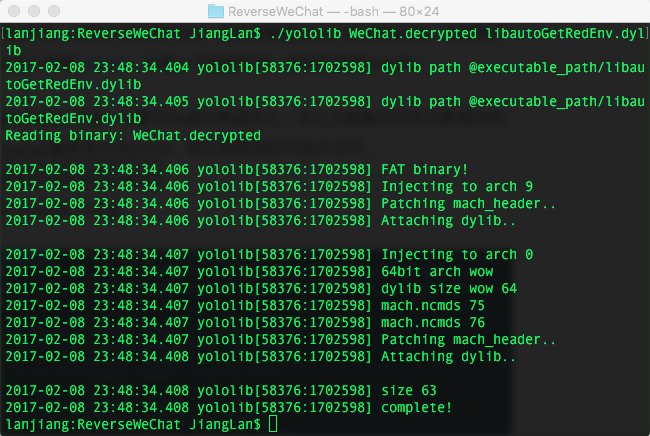
3. 使用iTunes下载微信ipa包（目前最新版为：`微信 6.5.4.ipa`）；
4. 将`微信 6.5.4.ipa`修改为`微信 6.5.4.zip`，并解压；
5. 找到Payload/WeChat（即WeChat.app，后缀可能被隐藏），将WeChat.app拷贝到ReverseWeChat目录中，
6. 将libautoGetRedEnv.dylib和已经注入dylib的可执行文件WeChat.decrypted拷贝到WeChat.app，并将WeChat.decrypted改名为WeChat(覆盖原来的可执行文件WeChat)。

### 重签名

0. 登陆Apple个人开发帐号或企业帐号，新建App ID（如com.tencent.xin.jl）、开发证书（发布证书也可以，创建后安装到本地），将需要安装插件版微信的iPhone UDID加入帐号中，新建Provisioning Profiles（选择刚新建的App ID、证书、设备），下载后重新命名为embedded.mobileprovision，并拷贝到WeChat.app中；
1. 在ReverseWeChat目录中新建Entitlements.plist，格式如下：

```
<?xml version="1.0" encoding="UTF-8"?>
<!DOCTYPE plist PUBLIC "-//Apple//DTD PLIST 1.0//EN" "http://www.apple.com/DTDs/PropertyList-1.0.dtd">
<plist version="1.0">
<dict>
	<key>application-identifier</key>
	<string>DE6N26DER6.com.tencent.xin.jl</string>
	<key>com.apple.developer.team-identifier</key>
	<string>DE6N26DER6</string>
	<key>get-task-allow</key>
	<true/>
	<key>keychain-access-groups</key>
	<array>
		<string>DE6N26DER6.com.tencent.xin.jl</string>
	</array>
</dict>
</plist>

```
application-identifier：APP唯一标识符，前缀为Team ID

com.apple.developer.team-identifier：Team ID（参考下图）

keychain-access-groups：证书组，填一个证书名称即可（参考下图）

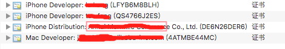

2. cd到ReverseWeChat目录，分别用codesign命令来为微信中的相关文件签名，如下图：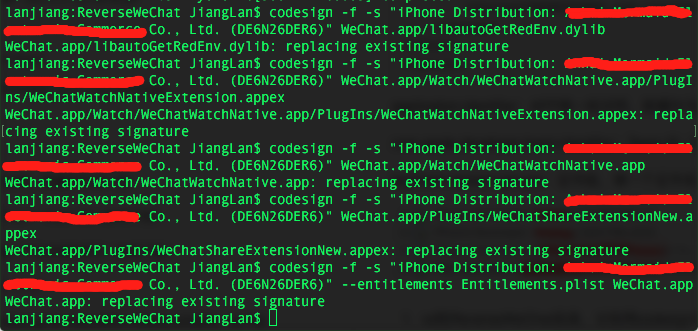

### 打包并安装

1. 仍然在ReverseWeChat目录，使用xcrun进行打包，如下命令：
`xcrun -sdk iphoneos PackageApplication -v WeChat.app  -o ~/WeChat.ipa`
执行后，会在根目录下生成重签的安装包WeChat.ipa；
2. 使用itools等工具将ipa包安装到iPhone上即可。

#### 使用方法

如果是直接使用我Github的代码生成的dylib，可按照以下方法操作：

1. 进入自己的微信聊天窗口；
2. 给自己发送触发红包设置的口令，默认为“波若波罗密”（代码中可修改）；
3. 开启抢红包插件开关；
4. 在群里发一个红包即可自动抢。


### 效果图

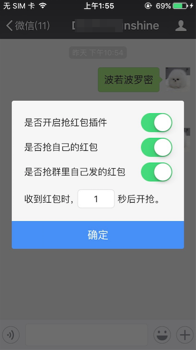

### 其它备注

* 查看二进制文件是否加密：
otool -l WeChat.app/WeChat | grep -B 2 crypt

* 查看所支持的架构：lipo -info xxx.dylib

* 去掉二进制文件arm64(用于破armv7的壳等)：lipo xxx -remove arm64 -output xxx.remove